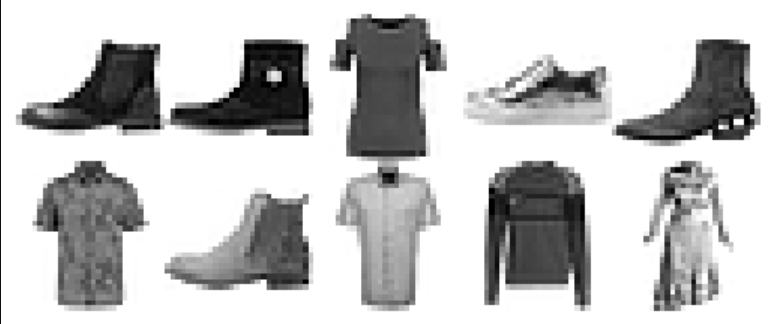
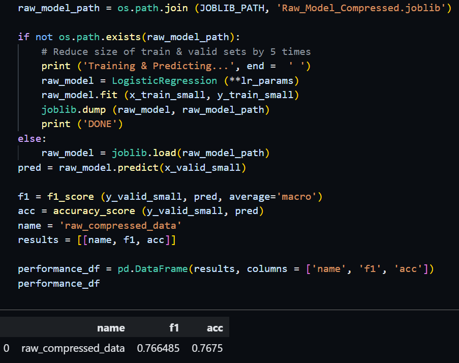
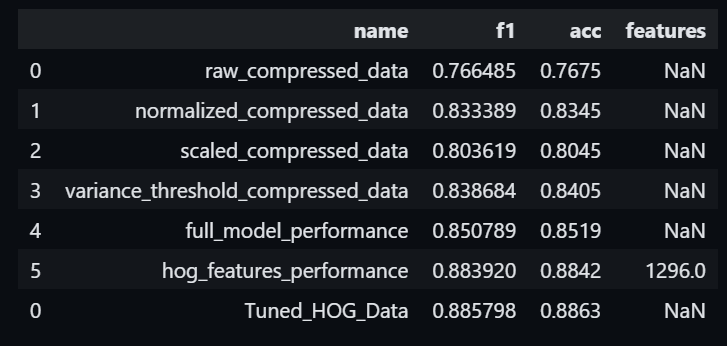
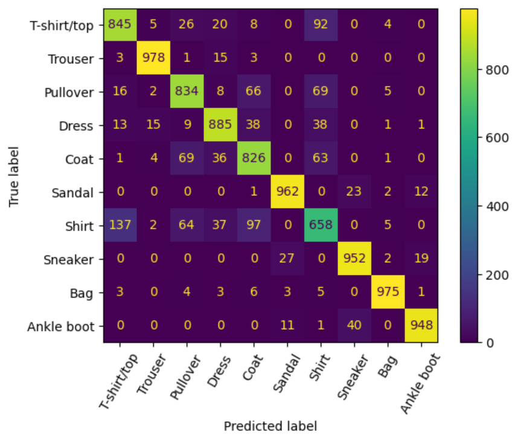
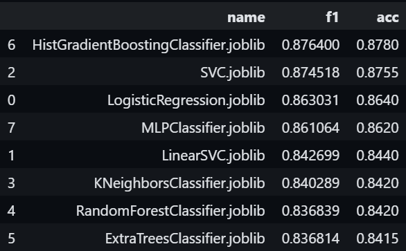
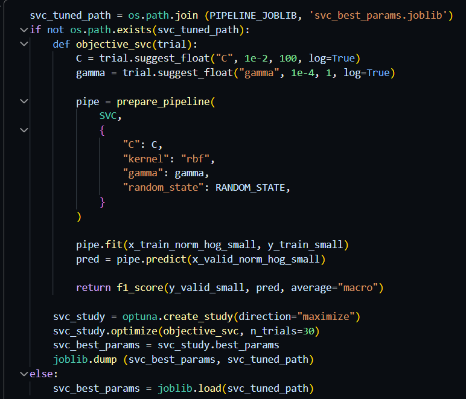
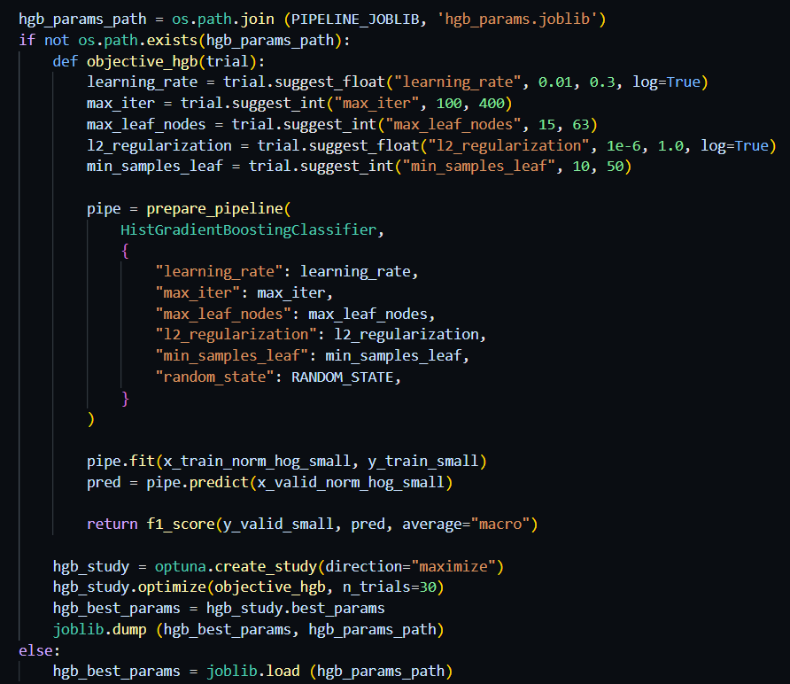
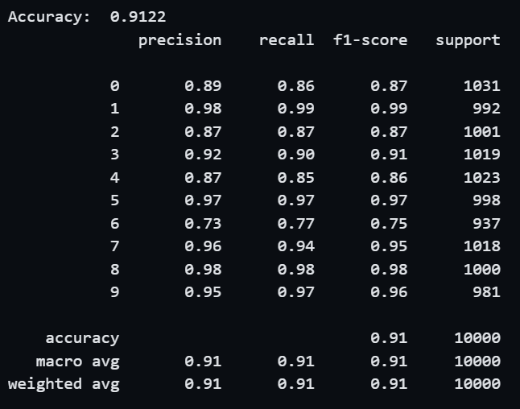
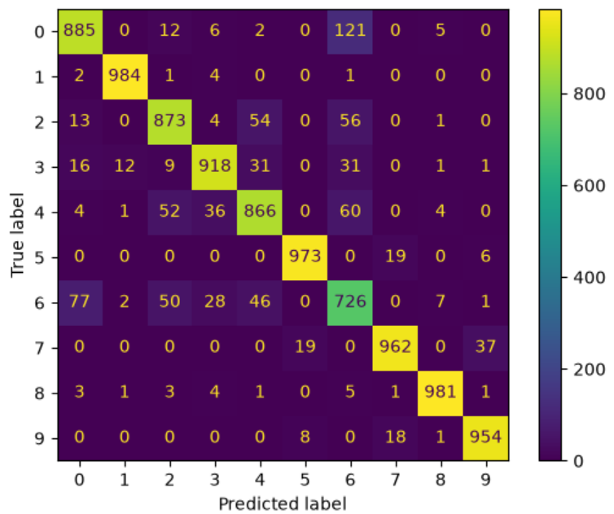

# Clothes Classification Model 
This project's goal is to build a classifcation model on the Fashion MNIST dataset. Despite the main usecase of this dataset is to validate the performance of Deel Learning models, this project will only experiment on Machine Learning models, with objecive is achieving over 90% accuracy.

## Project Overview 
```text
Fashion MINST Classification 
|-- Notebooks
|
|-- |-- Data_Experiment.ipynb:     - Experiment the data cleaning and manipulation techniques
|-- |-- Modeling.ipynb:            - Experiment on different machine learning models 
|
|-- Folders
|
|-- |-- CSV_FILES:                 - Saving the report tables created in Data_Experiment.ipynb
|-- |-- JOBLIB_FILES:              - Saving the parameters of experimented models in Data_Experiment.ipynb
|-- |-- MODELING_CSV:              - Saving the tables of ouput in Modeling.ipynb
|-- |-- PIPELINE_PATH:             - Saving the hyperparameters of pipelines in Modeling.ipynb 

The reason why tables and hyperparameters have to be saved is to avoid having to re run the code snippet multiple times (See the notebook for more details)
```

## Dataset
Fashion MNIST is a dataset of 70,000 images with 10 different types of clothes. Each clothe comes with a label, and the machine learning model is expected to predict the labels, knowing the images. Each image is 28x28 pixel, meaning the number of features provided to predict each image is 784. 


### 10 random instances of the dataset:

<p> 
    
</p>

## Data Experiment
The baseline model chosen for Data Experiment is Logistic Regression because of its linear characteristic, making it more sensitive to data improvements. 

### Baseline model achieves a poor performance on shrinked dataset: 

<p align = 'left'>
    
</p>

(See the notebook Data_Experiment.ipynb)

## Techniques Experimented 
The baseline model is then experimented on differnt combination of preprocessing techniques, involving Variance Threshold, HOG, PCA, Pixel Centering, Backgroun Noise Filtering, Data Augmentation.... Beyond this, the notebook also performed fast fine-tuning among several techniques, e.g. PCA, HOG, ... (See the notebook Data_Experiment.ipynb for more details). 


### The best pipeline achieves around 0.886 on f1 and accuracy: 
<p> 
     
    
</p>
(The error is fairly reasonable, see the notebook Data_Experiment.ipynb for more details)


### The best data prerocessing pipeline is: Normalization --> HOG --> Variance 

## Model Selection
In the notebook Modeling.ipynb, a range of machine learning models (linear, tree-based, gradient boosting) were experimented on the data pipeline. 

### Histogram Gradient Boosting & Supported Vector Machine had best performance:

<p> 
     
</p>
(See the notebook Modeling.ipynb for more details) 

## Hyperparameter Tuning 
The two models were fine-tuned on the shrinked dataset to reduce runtim and computational cost. The hyperameter process was implemented using Optuna Framework. 

### Optuna Objective Functions: 
<p> 
     
     
</p>

## Final Model
### Fine-Tuned SVC achieves 91% Accuracy and 0.91 f1_score, surpassing project's goal

### Classification Report & Confusion Matrix: 
<p> 
     
     
</p>
(See the notebook Modeling.ipynb for more details)